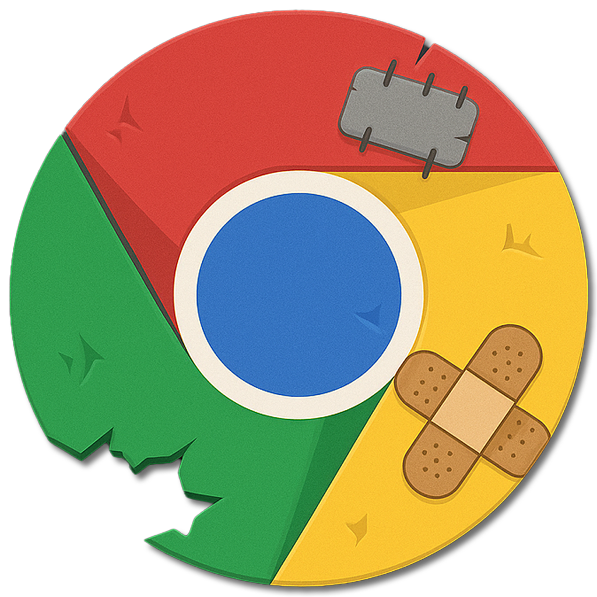

Shrome is my shitty browser build, duct-taped together with Metal, ImGui, and CEF3. It’s not meant for serious web browsing. It’s just a sandbox for me to get hands-on experience with these libraries. No promises, no roadmap, and very likely to be abandoned at any moment.

* [] fast rendering
* [] copy/paste
* [] context menu
* [] popup
* [] multi-tab
